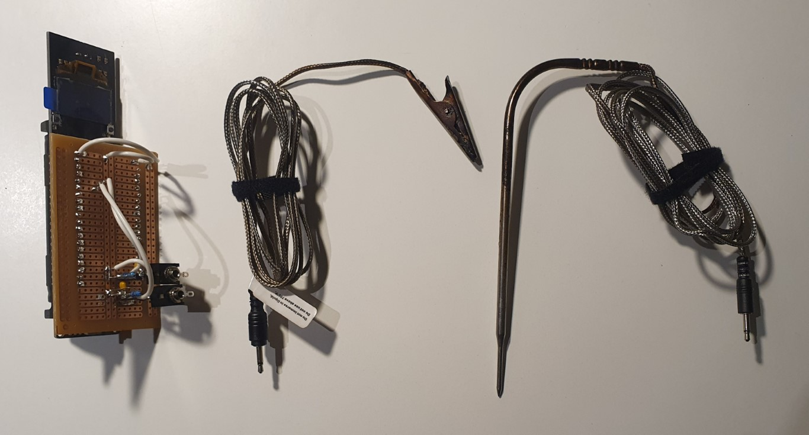

# Readme

The purpose of this project is to make a device to monitor bbq air and meat temperature to cook the perfect steak! The image below shows the current progress of the project - when a perfect steak is shown, this project is functional!

This project is currently functional and the temperature reading has an accuracy of +/-1 deg C. It uses bluetooth to communicate via bluetooth serial (e.g. android app: https://play.google.com/store/apps/details?id=de.kai_morich.serial_bluetooth_terminal&hl=en_AU&gl=US). This project initially started as an arduino based device and spring boarded off some great work done here: https://forum.arduino.cc/index.php?topic=231655.0, but since then it has moved to the ESP32 for a more compact design with inbuilt bluetooth functionality.

## Branches
* The "master" branch is the lastest functional ESP32 version of the meat cooker. 
* The "dev" branch is the working branch for new ESP32 features.
* The "arduino" branch is an archive of where this project got up to on the Arduino Uno.

## Next steps
* Check voltage divider resistances allow adequate analogue to digital conversion. For example, ESP32 can only measure between 0.2-3.08V effectively (which for the air sensor is 55C - 380C). This is ok, check it is ok for the meat probe.
* Implement multisampling for esp32 adc (see example code here: https://github.com/espressif/esp-idf/blob/aaf12390eb14b95589acd98db5c268a2e56bb67e/examples/peripherals/adc/main/adc1_example_main.c#L72-L84 and explanation here: https://docs.espressif.com/projects/esp-idf/en/latest/esp32/api-reference/peripherals/adc.html#minimizing-noise)
* Improve app interface
* 3D print case

## Items (all prices $AUD)
* 1 x meat sensor replacement Inkbird, $11.99 + $1.99, https://www.ebay.com.au/itm/PROBE-for-INKBIRD-IBT-4X-meat-thermometer-replacement-Accessories-REPLACE-sensor/222779014478?ssPageName=STRK%3AMEBIDX%3AIT&_trksid=p2057872.m2749.l2648
* 1 x bbq clip sensor replacement Inkbird, $10.99 + $1.99, https://www.ebay.com.au/itm/PROBE-Inkbird-cooking-thermometer-sensor-replacement-grill-clip-cable-replace/322770203997?ssPageName=STRK%3AMEBIDX%3AIT&_trksid=p2057872.m2749.l2648
* 2 x 2.5MM Stereo Chassis Socket, $1.85, https://www.jaycar.com.au/2-5mm-stereo-chassis-socket/p/PS0107
* 1 x ESP32 WOOROM-32 DEV board, ~$26
* 1 x breadboard PCB, ~$5
* 2 x 0.1 uF capacitor
* 1 x 1 kohm resistor
* 1 x 25 kohm resistor
* 1 x 40 pin female pin header
* Thin wire

## How to use
* Connect sensors by 2.5mm jacks
* Turn ESP32 on and connect to bluetooth
* Start cooking!

## Steps completed (newest on top)
* Setup ESP32 ADC converter (details: https://docs.espressif.com/projects/esp-idf/en/latest/esp32/api-reference/peripherals/adc.html)
* Put on ESP32 board with bluetooth (similar to https://github.com/dereulenspiegel/ibbq-gateway)
* Added functionality for rate of change of temperature
* Sensors arrived, did calibration and calculated Steinhart-Hart model coefficients
* Arduino screen working (I2C to the 1602 LCD) and showing temperatures
* Got code working, used potentiometer to simulate different temperatures (as resistances)